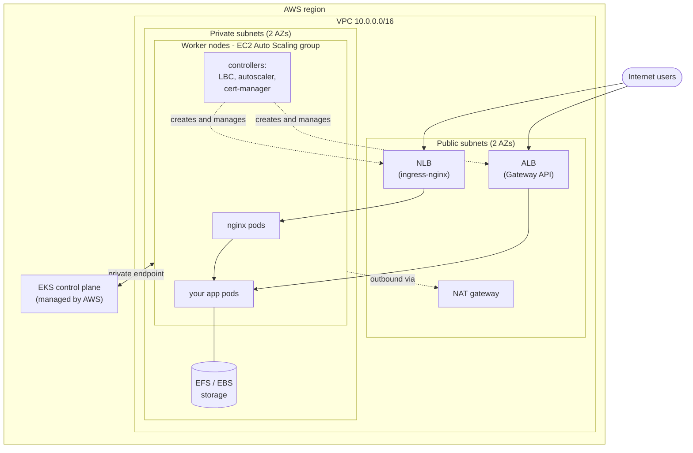
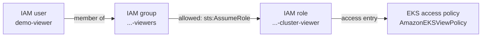

# Terraform AWS EKS Deployment

A complete, working Kubernetes platform on AWS, built with Terraform: network, cluster, worker nodes, user access, autoscaling, load balancing (Ingress **and** Gateway API), TLS tooling and storage. Every step also has a **Console** version, so you can build or inspect the same thing by clicking through the AWS web console.

**Who it is for:** anyone learning EKS, from first-time students to engineers who want a reference setup. It is a *development/learning* environment. Section 9 lists what to change before using it for production.

**What you will have at the end:** a cluster with 2 worker nodes that scale automatically, two public load balancers serving a demo app, and the tooling to issue TLS certificates and attach disks.

## Contents

1. [How it fits together](#how-it-fits-together)
2. [Before you start](#before-you-start)
3. [Deploy](#1-deploy)
4. [Access for people](#2-access-for-people)
5. [Platform add-ons](#3-platform-add-ons)
6. [Test Ingress and Gateway API](#4-test-ingress-and-gateway-api)
7. [Autoscaling: pods and nodes](#5-autoscaling-pods-and-nodes)
8. [Storage](#6-storage)
9. [Customization](#7-customization)
10. [Troubleshooting](#8-troubleshooting)
11. [Production hardening checklist](#9-production-hardening-checklist)
12. [Cleanup](#10-cleanup)

---

## How it fits together



Key ideas, in plain words:

| Term | Meaning |
|---|---|
| **EKS control plane** | The Kubernetes "brain" (API server, scheduler). AWS runs and patches it for you. |
| **Worker nodes** | The EC2 machines that actually run your containers (pods). |
| **Public / private subnet** | Public subnets host load balancers and the NAT gateway. Nodes live in private subnets, not directly reachable from the internet; the NAT gateway lets them download images. |
| **Add-on** | Extra software the cluster needs (networking, DNS, storage drivers). Either an *EKS add-on* (AWS-managed, installed by API) or a *Helm chart* (community, installed with `helm`). |
| **Ingress / Gateway API** | Two ways to describe "send web traffic for X to my service". Ingress is the older, widely used one; Gateway API is the newer, more expressive standard. |
| **Pod Identity** | Gives a single pod its own AWS permissions, instead of giving every node broad permissions. |
| **Access entry** | How EKS decides which AWS identity (user/role) may log in to the cluster. |
| **HPA vs Cluster Autoscaler** | HPA adds/removes *pods* based on CPU. Cluster Autoscaler adds/removes *nodes* when pods do not fit. |

## What gets created

| Layer | Resources | File |
|---|---|---|
| Network | VPC `10.0.0.0/16`, 2 public + 2 private subnets, internet gateway, 1 NAT gateway, route tables | `2-vpc.tf` .. `6-routes.tf` |
| Control plane | EKS cluster (API auth mode), IAM role, CloudWatch log group (14-day retention) | `7-eks.tf` |
| Core add-ons | `vpc-cni`, `kube-proxy`, `coredns` (EKS add-ons) | `7a-core-addons.tf` |
| Nodes | Launch template + Auto Scaling group (On-Demand, 1 x `t3a.large`), optional Spot group (1 node), access entry, instance profile; optional EKS managed node groups | `8-nodes.tf`, `8a-managed-nodes.tf` |
| Access | IAM groups → IAM roles → EKS access policies (newer, default); IAM users → Kubernetes groups (older, `access_model = "legacy"`) | `11-` (newer); `9-`, `10-` (older) |
| Platform | Metrics Server, Pod Identity Agent, Cluster Autoscaler | `12-`, `13-`, `14-` |
| Traffic | AWS Load Balancer Controller, ingress-nginx (NLB), Gateway API CRDs, cert-manager | `15-` .. `17-`, `21-` |
| Storage | EBS CSI add-on + `gp3` default class, EFS + CSI driver + `efs` class, OIDC provider | `18-` .. `20-` |
| Demos | Two-version sample app, Ingress, Gateway API, HPA and node-scaling examples | `examples/` |

Files are numbered in build order: network → control plane → add-ons → nodes → access → platform charts → traffic → storage.

### Choosing how worker nodes are built

There are two ways to run nodes on EKS. This repo implements **B**, which works in every account; **A** is shorter and is what you would normally pick if it works for you.

| | A. Managed node group | B. Self-managed (this repo) |
|---|---|---|
| Terraform | `aws_eks_node_group` | launch template + Auto Scaling group |
| AWS does for you | access entry, bootstrap, security group, draining on upgrade | nothing: you wire these yourself |
| Needs | EC2 Fleet API available in the account | only plain `RunInstances` |
| You patch the OS | AWS rolls updates for you on request | you replace the AMI and refresh instances |

**Why B here:** some AWS accounts (commonly new or restricted ones) cannot call the EC2 **Fleet** API. Managed node groups always launch through Fleet, so they sit in `CREATING` forever and the Auto Scaling group reports *"You've reached your quota for maximum Fleet Requests for this account"*. A plain Auto Scaling group with a launch template does not use Fleet, so it works. Fixing the account limit requires an AWS Support case.

Option A is already written for you in `8a-managed-nodes.tf` (On-Demand + Spot, 1 node each, same `capacity` labels). Turn it on with `terraform apply -var enable_managed_node_groups=true`; it is off by default because it hangs in accounts without EC2 Fleet. To use A *instead of* B, enable it and set `desired_capacity` of the groups in `8-nodes.tf` to 0 (or delete them). The core of it, if you want to write your own:

```hcl
resource "aws_eks_node_group" "general" {
  cluster_name    = aws_eks_cluster.eks.name
  node_group_name = "general"
  node_role_arn   = aws_iam_role.nodes.arn
  subnet_ids      = [aws_subnet.private_zone1.id, aws_subnet.private_zone2.id]
  instance_types  = ["t3a.large"]

  scaling_config {
    desired_size = 2
    min_size     = 0
    max_size     = 10
  }

  lifecycle { ignore_changes = [scaling_config[0].desired_size] }
  depends_on = [aws_iam_role_policy_attachment.nodes, aws_eks_addon.vpc_cni, aws_eks_addon.kube_proxy]
}
```

Self-managed nodes (B) need three things that a managed node group does automatically. All three are in `8-nodes.tf`; if nodes do not join, check these first:

1. an **EKS access entry** of type `EC2_LINUX` for the node IAM role (otherwise the kubelet cannot authenticate);
2. the **cluster security group** attached to the launch template (otherwise nodes cannot reach the API server's private endpoint);
3. a `NodeConfig` in the user data holding the cluster name, endpoint, CA and service CIDR (Amazon Linux 2023 does not look these up itself).

### On-Demand and Spot node groups

`8-nodes.tf` defines two node groups of one node each, so you can show both capacity types:

| | On-Demand group (default, on) | Spot group (`enable_spot_nodes`, off by default) |
|---|---|---|
| Node label | `capacity=on-demand` | `capacity=spot` |
| Price | full price, never reclaimed | up to ~70% cheaper, AWS can take it back with 2 minutes' notice |
| Use for | databases, anything that must stay up | stateless, restartable work (batch, workers, dev) |
| Max nodes | 10 | 5 |

Both groups are tagged for the Cluster Autoscaler, so each scales on its own. Pods choose a pool with `nodeSelector` (see `examples/50-capacity-types.yaml`):

```bash
terraform apply -var enable_spot_nodes=true     # adds the Spot group
kubectl get nodes -L capacity,role
kubectl apply -f examples/50-capacity-types.yaml
kubectl -n demo get pods -o wide                # on-demand-app and spot-app on different nodes
```

The Spot group is a plain Auto Scaling group whose launch template requests Spot (`instance_market_options`), with no `mixed_instances_policy`, so it avoids the EC2 Fleet API. **It still needs Spot capacity in your account.** Some new accounts get `Max spot instance count exceeded` on every Spot request even though Service Quotas shows a normal value (the author's account did, which is why it is off by default); the fix is an AWS Support case. You can test an account with `aws ec2 run-instances --instance-market-options MarketType=spot ...`. The managed-node-group equivalent is already written in `8a-managed-nodes.tf` (`capacity_type = "SPOT"` with three instance types); enable it with `-var enable_managed_node_groups=true` in an account where EC2 Fleet and Spot both work. The `capacity` labels are identical, so the same `nodeSelector` examples work for both kinds.

Console: *EC2 → Launch templates → Create* as in section 1, then under *Advanced details → Purchasing option* tick **Request Spot Instances**, and use `--node-labels=role=general,capacity=spot` in the user data.

## Before you start

You need:

- an AWS account and an AWS CLI profile with admin-level rights (VPC, EKS, IAM, EC2, EFS)
- Terraform `>= 1.5.7`, AWS CLI v2, and `kubectl` (Helm is only needed for manual experiments)
- `aws` and `kubectl` on the PATH of the machine running Terraform, because `21-gateway-api-crds.tf` calls them

Two settings are specific to the author's machine; change them to yours:

| Setting | Where | Default |
|---|---|---|
| AWS CLI profile | `1-providers.tf` and `21-gateway-api-crds.tf` | `ostad` |
| Region / zones / cluster name / Kubernetes version | `0-locals.tf` | `ap-south-1`, `a`/`b`, `development-demo`, `1.36` |

Check which Kubernetes versions your region offers before applying: `aws eks describe-cluster-versions --region <region> --query 'clusterVersions[].clusterVersion'`. Commands below use the default names; substitute your own if you changed them.

**Cost warning:** while running, this bills for the EKS control plane, a NAT gateway, EC2 nodes, a network load balancer, an application load balancer and EFS. Destroy it when you finish (section 10).

---

## 1. Deploy

### Terraform

```bash
terraform init
terraform plan         # read it: ~75 resources
terraform apply        # ~20 min: control plane ~10 min, then nodes and charts
```

Connect and check:

```bash
aws eks update-kubeconfig --region ap-south-1 --name development-demo --profile <your-profile> --alias development-demo
kubectl get nodes          # 1 node (2 with Spot enabled), STATUS Ready
kubectl get pods -A        # everything Running
```

### Console

Build the same stack by hand, in this order. Keep the region selector (top right) on one region throughout.

1. **VPC**: *VPC → Create VPC → VPC and more*. Name `development`, IPv4 `10.0.0.0/16`, 2 AZs, 2 public + 2 private subnets, **NAT gateways: 1 per VPC**, DNS hostnames and DNS resolution enabled. Then tag the subnets (*VPC → Subnets → select → Tags*):
   - public subnets: `kubernetes.io/role/elb = 1`
   - private subnets: `kubernetes.io/role/internal-elb = 1`
   - all four: `kubernetes.io/cluster/development-demo = owned`

   The role tags are how the load balancer controller picks subnets for internet-facing vs. internal load balancers.
2. **Cluster IAM role**: *IAM → Roles → Create role → AWS service → EKS → EKS - Cluster*. Name `development-demo-eks-cluster`, attach `AmazonEKSClusterPolicy`. (Terraform also attaches four extra `AmazonEKS…Policy` policies that only matter for EKS Auto Mode.)
3. **Cluster**: *EKS → Clusters → Create cluster → Custom configuration*. Name `development-demo`, your Kubernetes version, the role from step 2. Turn **EKS Auto Mode off**. Networking: the VPC, the two **private** subnets, endpoint access **Public and private**. Access: **EKS API** authentication, and keep *Allow cluster administrator access* ticked. Logging: API server, Audit, Authenticator. Add-ons: leave the preselected VPC CNI, kube-proxy and CoreDNS on (Terraform manages the same three explicitly in `7a-core-addons.tf`).
4. **More add-ons**: *Cluster → Add-ons → Get more add-ons*: **Amazon EKS Pod Identity Agent** and **Amazon EBS CSI Driver** (the latter needs a role, see section 6). CoreDNS shows *Degraded* until nodes exist; that is expected.
5. **Node IAM role**: *IAM → Create role → AWS service → EC2*. Name `development-demo-eks-nodes`, attach `AmazonEKSWorkerNodePolicy`, `AmazonEKS_CNI_Policy`, `AmazonEC2ContainerRegistryReadOnly`, `AmazonSSMManagedInstanceCore`.
6. **Nodes**
   - **Option A (managed):** *Cluster → Compute → Add node group*: the node role, private subnets, `t3a.large`, min 0 / desired 2 / max 10. Done.
   - **Option B (self-managed, what this repo does):**
     1. *Cluster → Access → Create access entry*: principal = the node role, type **EC2 Linux**. Click through the wizard without adding groups or access policies: the console does not allow policies on this type, and none are needed (EKS gives the entry group `system:nodes` and username `system:node:{{EC2PrivateDNSName}}`, which is all a kubelet needs). Access policies are only for `Standard` entries, i.e. people and tools (section 2).
     2. *EC2 → Launch templates → Create*: AMI = *Amazon EKS-optimized Amazon Linux 2023* (search the AMI catalog for `amazon-eks-node-al2023-x86_64-standard-<k8s version>`), type `t3a.large`, **IAM instance profile** = the node role, **security group = the cluster security group** (*EKS → cluster → Networking → Cluster security group*), storage 100 GiB gp3 encrypted, metadata *IMDSv2 required*. Under *Advanced details → User data* paste:

        ```text
        MIME-Version: 1.0
        Content-Type: multipart/mixed; boundary="//"

        --//
        Content-Type: application/node.eks.aws

        ---
        apiVersion: node.eks.aws/v1alpha1
        kind: NodeConfig
        spec:
          cluster:
            name: development-demo
            apiServerEndpoint: <API server endpoint from the cluster page>
            certificateAuthority: <Certificate authority from the cluster page>
            cidr: 172.20.0.0/16
          kubelet:
            flags:
              - --node-labels=role=general

        --//--
        ```

        (`cidr` is the cluster's *Service IPv4 range*, shown under Networking.)
     3. *EC2 → Auto Scaling groups → Create*: the launch template, the two private subnets, desired 2 / min 0 / max 10, health check EC2. Add tags `kubernetes.io/cluster/development-demo = owned`, `k8s.io/cluster-autoscaler/enabled = true`, `k8s.io/cluster-autoscaler/development-demo = owned` (all *propagate at launch*). Do **not** enable a mixed-instances policy or Spot here: that routes launches through Fleet again.
7. **Verify**: *Cluster → Compute* lists the nodes as *Ready* after about 2 minutes. If they never appear, re-check the security group (6B.2), the access entry (6B.1) and the user data.

---

## 2. Access for people

Two access models ship in this repo. Pick one with `access_model` (default `groups`):

```bash
terraform apply                              # newer process (default)
terraform apply -var access_model=legacy     # older process
```

Switching models destroys one set of users/roles/entries and creates the other, so choose before you hand out credentials.

### Newer process (recommended): IAM group → IAM role → EKS access policy

File: `11-access-groups.tf`.



- Two roles (`cluster-viewer`, `cluster-admin`), each with **one** access entry. People never get an entry of their own.
- Permissions come from EKS **access policies** (`AmazonEKSViewPolicy`, `AmazonEKSClusterAdminPolicy`). No Kubernetes groups and **no RBAC bindings are needed**.
- The role's own AWS permission is only `eks:DescribeCluster` (enough to build a kubeconfig); everything inside the cluster is decided by the access policy.
- **Grant access:** add the IAM user to the group (the `eks_viewer_users` / `eks_admin_users` variables, or `aws iam add-user-to-group`).
- **Revoke access:** remove the user from the group. New logins are refused at once; a role session they already hold stays valid until it expires (`max_session_duration`, 1 hour here).
- Scope narrower than the whole cluster by changing `access_scope` in `11-access-groups.tf` to `type = "namespace"` with `namespaces = ["dev"]`.

Log in as a user:

```bash
# 1. as an admin, create a key for the user (demo-viewer / demo-admin)
aws iam create-access-key --user-name demo-viewer

# 2. in ~/.aws/credentials and ~/.aws/config add:
#    [profile viewer-user]  -> the keys
#    [profile viewer]
#    role_arn       = arn:aws:iam::<account-id>:role/development-demo-cluster-viewer
#    source_profile = viewer-user

# 3. build a kubeconfig and use it
aws eks update-kubeconfig --name development-demo --region ap-south-1 --profile viewer --alias viewer
kubectl --context viewer get pods -A                          # allowed
kubectl --context viewer create deployment x --image=nginx    # forbidden
```

The role ARNs are in `terraform output cluster_access_roles`.

Tested on this cluster: the viewer could list pods but got `forbidden` creating a deployment; the admin could create and delete it; after removing the viewer from its group, a new `AssumeRole` failed with `AccessDenied`.

**Console:**

1. *IAM → Roles → Create role → AWS account → This account*, name `development-demo-cluster-viewer`. Add an inline policy allowing `eks:DescribeCluster` on the cluster. Repeat for `...-cluster-admin`.
2. *EKS → cluster → Access → IAM access entries → Create access entry*: principal = the role, type *Standard*, no Kubernetes groups. On the next page add the access policy `AmazonEKSViewPolicy` (or `AmazonEKSClusterAdminPolicy`) with scope *Cluster* or chosen namespaces.
3. *IAM → User groups → Create group* (`...-viewers`), then *Permissions → Create inline policy*: allow `sts:AssumeRole` on that role's ARN.
4. *IAM → Users → Create user*, add to the group. Create an access key under *Security credentials*.
5. To revoke: *IAM → User groups → group → Users → select → Remove*.

### Older process (legacy): IAM users mapped to Kubernetes groups

Files: `9-add-developer-user.tf`, `10-add-manager-role.tf`. Use with `-var access_model=legacy`. It still works, but it is harder to manage: each person needs their own access entry, and permissions live in Kubernetes RBAC objects you maintain by hand.

Terraform creates:

- **`demo-developer`** (IAM user) is mapped to Kubernetes group `my-viewer`.
- **`manager`** (IAM user) may assume role `development-demo-eks-admin`, which is mapped to group `my-admin`. The user is also mapped directly, for temporary access.

An access entry only says *who* someone is. What they may *do* comes from Kubernetes RBAC, and **this repo does not ship RBAC bindings**. Until you create them, both groups can log in but are denied everything. A "group" here is just a label string on the identity; Kubernetes has no group objects to create, so the binding is all that is needed:

```bash
kubectl create clusterrolebinding my-viewer --clusterrole=view          --group=my-viewer
kubectl create clusterrolebinding my-admin  --clusterrole=cluster-admin --group=my-admin
```

Log in as a legacy user:

```bash
# 1. as an admin, create access keys
aws iam create-access-key --user-name demo-developer
aws iam create-access-key --user-name manager

# 2. in ~/.aws/credentials and ~/.aws/config create profiles:
#    [profile dev]       -> the demo-developer keys
#    [profile manager]   -> the manager keys
#    [profile eks-admin]
#    role_arn       = arn:aws:iam::<account-id>:role/development-demo-eks-admin
#    source_profile = manager

# 3. build a kubeconfig context per identity
aws eks update-kubeconfig --name development-demo --region ap-south-1 --profile dev       --alias dev
aws eks update-kubeconfig --name development-demo --region ap-south-1 --profile eks-admin --alias admin
kubectl --context dev get pods -A
```

The legacy developer IAM policy grants `s3:*` on `*` and the admin role `eks:*`; both are broader than needed.

Legacy console steps:

1. *IAM → Users → Create user* (`demo-developer`, `manager`). Developer: attach a policy with `eks:DescribeCluster` and `eks:ListClusters`. Manager: attach a policy allowing `sts:AssumeRole` on the admin role.
2. *IAM → Roles → Create role → AWS account → This account*, name `development-demo-eks-admin`, attach a policy with `eks:*` and `iam:PassRole` (condition `iam:PassedToService = eks.amazonaws.com`).
3. *EKS → cluster → Access → IAM access entries → Create access entry*: pick the principal, type *Standard*, add **Kubernetes groups** `my-viewer` / `my-admin`.
4. *IAM → Users → user → Security credentials → Create access key*.
5. From a session that is already cluster admin, apply the two `clusterrolebinding` commands above.

Revoking in the legacy model means deleting that person's access entry (`aws_eks_access_entry.developer` / `manager_user`, or *EKS → Access → entry → Delete*). A token they already hold works for up to about 15 more minutes.

> **Moving off legacy:** the newer process replaces per-person entries with group membership, removes the RBAC bindings, and gives a one-step revoke.

> **No local tools?** Open **AWS CloudShell** (icon in the console top bar) and run `aws eks update-kubeconfig --name development-demo --region ap-south-1`; then `kubectl` works with your console identity. If you restrict the public API CIDRs, CloudShell must be inside them.

---

## 3. Platform add-ons

| Component | Installed by | Purpose |
|---|---|---|
| Metrics Server | Helm, `kube-system` | provides CPU/memory numbers for `kubectl top` and the HPA |
| Pod Identity Agent | EKS add-on | gives pods AWS credentials without per-pod annotations |
| Cluster Autoscaler | Helm + Pod Identity role | adds/removes nodes by resizing the Auto Scaling group (found via its `k8s.io/cluster-autoscaler/*` tags) |
| AWS Load Balancer Controller (LBC) | Helm `3.6.0` + Pod Identity role | creates NLBs/ALBs for Services, Ingresses and Gateways |
| ingress-nginx | Helm `4.15.1`, namespace `ingress` | in-cluster traffic router, class `external-nginx` (default), fronted by an internet-facing NLB |
| Gateway API CRDs | `kubectl apply --server-side` | v1.6.3 standard channel, saved in `gateway-api/` |
| cert-manager | Helm `v1.21.2` | issues TLS certificates; Gateway API support on |

**Why both LBC and ingress-nginx?** They do different jobs. ingress-nginx is the traffic *router* inside the cluster. LBC is the AWS-side *builder*: when a Service asks for a load balancer, it creates the actual NLB/ALB, target groups and security groups. The annotations in `values/nginx-ingress.yaml` are instructions to LBC. Traffic flow for Ingress: internet → NLB (built by LBC) → nginx pods → your app.

**Order matters:** the Gateway API CRDs must exist *before* LBC and cert-manager start, because both only enable their Gateway features when they see the CRDs at startup. If you install the CRDs later, restart them: `kubectl -n kube-system rollout restart deploy aws-load-balancer-controller`.

### Keep the LBC IAM policy current

`iam/AWSLoadBalancerController.json` is the official policy. New LBC releases call new AWS APIs; with a stale policy a Service stays `<pending>` and `kubectl describe svc` shows `AccessDenied … DescribeListenerAttributes`. Refresh it with:

```bash
curl -fL https://raw.githubusercontent.com/kubernetes-sigs/aws-load-balancer-controller/main/docs/install/iam_policy.json -o iam/AWSLoadBalancerController.json
terraform apply
```

### Helm repositories (only for manual `helm` use)

```bash
helm repo add eks https://aws.github.io/eks-charts
helm repo add ingress-nginx https://kubernetes.github.io/ingress-nginx
helm repo add jetstack https://charts.jetstack.io
helm repo add metrics-server https://kubernetes-sigs.github.io/metrics-server/
helm repo add autoscaler https://kubernetes.github.io/autoscaler
helm repo add aws-efs-csi-driver https://kubernetes-sigs.github.io/aws-efs-csi-driver/
helm repo update
```

### Console

The console installs the *EKS add-ons* (VPC CNI, kube-proxy, CoreDNS, Pod Identity Agent, EBS CSI, Metrics Server) from *Cluster → Add-ons*. The Helm charts (LBC, ingress-nginx, cert-manager, autoscaler, EFS CSI) have no console button: run `helm install` from CloudShell or your laptop. For the AWS-side permissions of the load balancer controller:

1. *IAM → Policies → Create policy → JSON*: paste `iam/AWSLoadBalancerController.json`, name it `AWSLoadBalancerControllerIAMPolicy`.
2. *IAM → Roles → Create role → Custom trust policy*: principal `pods.eks.amazonaws.com`, actions `sts:AssumeRole` and `sts:TagSession`. Attach the policy. (The autoscaler and EBS CSI roles have the same shape.)
3. *EKS → cluster → Access → Pod Identity associations → Create*: that role, namespace `kube-system`, service account `aws-load-balancer-controller`.
4. Install the Gateway API CRDs first: `kubectl apply --server-side -f https://github.com/kubernetes-sigs/gateway-api/releases/download/v1.6.3/standard-install.yaml`
5. `helm install aws-load-balancer-controller eks/aws-load-balancer-controller -n kube-system --version 3.6.0 --set clusterName=development-demo --set serviceAccount.name=aws-load-balancer-controller --set vpcId=<vpc-id>`
6. `helm install external ingress-nginx/ingress-nginx -n ingress --create-namespace --version 4.15.1 -f values/nginx-ingress.yaml`
7. `helm install cert-manager jetstack/cert-manager -n cert-manager --create-namespace --version v1.21.2 --set crds.enabled=true --set config.enableGatewayAPI=true`

---

## 4. Test Ingress and Gateway API

`examples/` deploys two versions of Argo's `rollouts-demo` app (blue and yellow) and exposes them two ways. More detail in [examples/README.md](examples/README.md).

```bash
kubectl apply -f examples/00-apps.yaml
kubectl apply -f examples/10-ingress.yaml        # nginx -> NLB
kubectl apply -f examples/20-gateway-api.yaml    # AWS Gateway -> ALB

kubectl -n ingress get svc external-ingress-nginx-controller -o jsonpath='{.status.loadBalancer.ingress[0].hostname}'
kubectl -n demo get gateway demo-gateway -o jsonpath='{.status.addresses[0].value}'

# wait 2-3 minutes for the load balancers, then (replace <hostname>):
for i in $(seq 10); do curl -s http://<hostname>/color; done
```

Expected: the Ingress always answers `"blue"`; the Gateway answers a mix of `"blue"` and `"yellow"` (the `HTTPRoute` splits 50/50).

| | Ingress | Gateway API |
|---|---|---|
| Load balancer | NLB → nginx pods → app | ALB → app pods directly (`targetType: ip`) |
| Routing config | `Ingress` + nginx annotations | `Gateway` + `HTTPRoute` (+ AWS `LoadBalancerConfiguration`, `TargetGroupConfiguration`) |
| Traffic split | needs canary annotations | built-in `weight` |
| Controller | ingress-nginx | AWS Load Balancer Controller only |

> The upstream ingress-nginx project has been announced for retirement. Prefer the Gateway API path for new workloads.

### Console

- *EC2 → Load Balancing → Load Balancers*: one NLB `k8s-ingress-external-…` and one ALB `k8s-demo-demogate-…`, state *Active*.
- *EC2 → Target Groups → select → Targets*: pod IPs should be *healthy*. The ALB listener's *Rules* tab shows the 50/50 weighted forward to the blue and yellow target groups.
- Paste a load balancer's DNS name into a browser.
- To apply the YAML without local tools: CloudShell → *Actions → Upload file* → `kubectl apply -f …`.

---

## 5. Autoscaling: pods and nodes

Two layers scale independently:

1. **HPA** adds pods when CPU rises. It needs Metrics Server and a CPU *request* on the pods (utilization is measured against the request).
2. **Cluster Autoscaler** adds nodes when pods cannot be scheduled (`Pending`), and removes nodes that stay underused.

```bash
# Pods
kubectl apply -f examples/30-hpa.yaml
kubectl -n demo get hpa php-apache -w            # TARGETS goes above 50%, REPLICAS grows
kubectl -n demo delete deploy load-generator     # stop the load; replicas fall back

# Nodes (8 pods x 1 CPU do not fit on 2 nodes)
kubectl apply -f examples/40-node-autoscaling.yaml
kubectl get nodes -w                             # new nodes within ~2-4 min
kubectl delete -f examples/40-node-autoscaling.yaml
kubectl get nodes -w                             # nodes removed after ~10 min idle
```

Measured on this setup: pods grew 1 → 5 under load and returned to 1; nodes grew 2 → 10 (the Auto Scaling group maximum) and returned to 2 about 12 minutes after the load stopped.

**Cluster Autoscaler vs Karpenter.** This repo uses the Cluster Autoscaler: it resizes an existing Auto Scaling group, so it can only add nodes of the type that group uses. Karpenter has no Auto Scaling group; it reads Pending pods and launches whichever EC2 instance type fits, which is usually faster and cheaper but needs its own controller, `NodePool`/`EC2NodeClass` objects and extra IAM/SQS setup. Karpenter launches through the EC2 Fleet API, so it will not work in accounts where Fleet is blocked (see "Choosing how worker nodes are built").

### Console

- *EC2 → Auto Scaling groups → select → Activity* shows each scale-out/in with its reason. *Instance management* shows the nodes.
- *EKS → cluster → Compute* shows nodes joining. Pods and HPA: CloudShell → `kubectl get hpa -n demo`.

---

## 6. Storage

- **EBS** (`gp3`, default class): EBS CSI add-on + Pod Identity role. `WaitForFirstConsumer`, volume expansion on. Use for one pod's disk.
- **EFS** (`efs` class): encrypted file system with mount targets in both private subnets (cluster security group), the EFS CSI driver chart, `efs-ap` provisioning. Use for shared `ReadWriteMany` storage across pods.

```bash
kubectl get storageclass
```

**Console:** EBS: *Cluster → Add-ons → Amazon EBS CSI Driver*, then choose or create the Pod Identity role (policy `AmazonEBSCSIDriverPolicy`). EFS: *EFS → Create file system*, then *Network → Mount targets* in the two private subnets using the cluster security group (NFS port 2049 must be allowed from the nodes; the cluster security group allows its own members).

---

## 7. Customization

| Change | Where |
|---|---|
| environment, region, zones, cluster name, Kubernetes version | `0-locals.tf` |
| who may reach the API server from the internet | `api_allowed_cidrs` in `0-locals.tf` |
| node type, size, disk, scaling; self-managed Spot group on/off; managed node groups on/off | `8-nodes.tf`, `8a-managed-nodes.tf`; `enable_spot_nodes`, `enable_managed_node_groups` in `0-locals.tf` |
| access model and who is in each group | `access_model`, `eks_viewer_users`, `eks_admin_users` in `0-locals.tf` |
| AWS profile | `1-providers.tf`, `21-gateway-api-crds.tf` |
| Helm values | `values/` |
| Gateway API version | replace `gateway-api/standard-install.yaml` |

Core add-ons are deliberately unpinned so EKS picks the compatible default when you change `eks_version`.

---

## 8. Troubleshooting

| Symptom | Cause / fix |
|---|---|
| Managed node group stuck `CREATING`; Auto Scaling activity says *quota for maximum Fleet Requests* | The account cannot use EC2 Fleet. Use the self-managed group (this repo) or open an AWS Support case. |
| Nodes launch but never join | Missing cluster security group on the launch template, missing `EC2_LINUX` access entry, or wrong user data. Open a shell with `aws ssm start-session` and read `journalctl -u kubelet`. |
| Service `EXTERNAL-IP` stays `<pending>` | `kubectl describe svc …`. `AccessDenied` means refresh the LBC IAM policy (section 3). |
| `helm_release` fails: *cannot re-use a name that is still in use* | A failed release is left in the cluster: `helm uninstall <name> -n <namespace>`, then `terraform apply`. |
| Gateways are ignored by the controller | CRDs were installed after LBC started: restart the LBC deployment. |
| CoreDNS add-on `Degraded` | Normal until nodes are Ready. |
| HPA shows `<unknown>` for CPU | Metrics Server not ready, or pods have no CPU `requests`. |
| A user can log in but every `kubectl` call is `forbidden` | Newer model: the role is missing its access policy association. Legacy model: the `clusterrolebinding` for their group was never created. |
| `terraform destroy` hangs on subnets/VPC | Leftover load balancers, network interfaces or security groups created by LBC. See section 10. |

---

## 9. Production hardening checklist

This repo is tuned for learning. Before running real workloads, work through this list. "In repo" says what exists today.

### State, secrets and change control

| Do this | Why | In repo |
|---|---|---|
| Store Terraform state in S3 with locking and versioning; never in git | State contains tokens and secrets; local state is lost with the laptop and cannot be shared | local `terraform.tfstate` (git-ignored) |
| Commit `.terraform.lock.hcl` and keep provider versions pinned | Reproducible builds | providers use `~>` ranges |
| Pin EKS add-on versions and the node AMI id | `most_recent` AMI and unpinned add-ons change under you on the next apply | both unpinned |
| Split environments (dev/stage/prod) into separate state and variables | One mistake should not touch production | single environment in `locals` |
| Turn on envelope encryption of Kubernetes Secrets with a KMS key (`encryption_config`) | Secrets are otherwise only base64 in etcd | not set |

### Network and access

| Do this | Why | In repo |
|---|---|---|
| Restrict `api_allowed_cidrs` to your office/VPN, or disable public endpoint access | `0.0.0.0/0` exposes the API server to the internet | `0.0.0.0/0` |
| One NAT gateway per AZ and nodes in 3 AZs | One NAT or AZ is a single point of failure | 1 NAT, 2 AZs |
| Set `bootstrap_cluster_creator_admin_permissions = false` and grant admin to a named role | Avoid a hidden permanent admin | `true` |
| Keep the newer access model (groups + roles, no per-person entries); add MFA (`aws:MultiFactorAuthPresent`) to the role trust policies | Easy audit and revoke | newer model is the default; MFA not set. The legacy model has broad `s3:*` / `eks:*` |
| Kubernetes NetworkPolicies (VPC CNI supports them) and Pod Security Standards (`restricted`) | Pods can currently talk to every pod and run privileged | none |
| Keep IMDSv2 with hop limit 1 so pods cannot steal node credentials | Standard EKS hardening | already set |
| Use Pod Identity per workload, not the node role, for AWS access | Blast radius | used for all controllers |

### Reliability

| Do this | Why | In repo |
|---|---|---|
| Run at least 2 replicas of every important app, spread across zones (`topologySpreadConstraints`) and add PodDisruptionBudgets | Node drains and autoscaler scale-in otherwise cause downtime | demo apps only |
| Run critical pods On-Demand and tolerant ones on Spot, with several instance types per Spot pool | Capacity and cost; mixed-instance groups need EC2 Fleet | On-Demand plus an optional single-type Spot group |
| Patch nodes on a schedule: new AMI, then an Auto Scaling *instance refresh* | Self-managed nodes are not patched for you | manual |
| Back up persistent data (EBS snapshots, EFS backup, Velero for cluster objects) | `terraform destroy` or a bad deploy loses data | none |
| Set resource `requests`/`limits` and a `LimitRange`/`ResourceQuota` per namespace | Autoscalers and the scheduler depend on requests | demo apps only |

### Traffic and TLS

| Do this | Why | In repo |
|---|---|---|
| Serve HTTPS: ACM certificate on the ALB/NLB, or cert-manager `ClusterIssuer` (Let's Encrypt) | Demos use plain HTTP | cert-manager installed, no issuer |
| Add AWS WAF on the ALB, and consider `internal` load balancers for private services | Internet-facing by default | internet-facing |
| Plan the move from ingress-nginx to Gateway API | ingress-nginx upstream is being retired | both present |

### Observability and cost

| Do this | Why | In repo |
|---|---|---|
| Metrics and alerts: Amazon Managed Prometheus/Grafana, Container Insights or kube-prometheus-stack | You only learn about problems from users otherwise | Metrics Server only |
| Application logs to CloudWatch or Loki; keep the 14-day control-plane log retention | Debugging and audit | control-plane logs only |
| Tag everything and set an AWS Budget and billing alarm | A forgotten NAT gateway plus load balancers is the usual surprise bill | few tags |
| Keep `max_size` of the node group a deliberate cost ceiling | The autoscaler followed a load test straight to 10 nodes here | 10 |
| Add `prevent_destroy` or deletion protection on data (EFS, load balancers) | Accidents | none |

A reasonable order: remote state → restrict API access → HTTPS → least-privilege IAM → backups → observability → multi-AZ NAT and replicas.

---

## 10. Cleanup

Order matters. The AWS Load Balancer Controller creates load balancers, target groups and security groups *inside your VPC* that Terraform does not know about. If the cluster is destroyed first, those are orphaned and the VPC cannot be deleted. So: delete what makes load balancers first, wait, then destroy.

```bash
# 1. delete everything that owns a load balancer (the demo, any of your own Services/Ingresses/Gateways)
kubectl delete -f examples/ --wait=true

# 2. release the ingress NLB (this also removes cert-manager, which depends on it)
terraform destroy -target=helm_release.external_nginx

# 3. check the load balancers are really gone (empty output = good)
aws elbv2 describe-load-balancers --query 'LoadBalancers[].LoadBalancerName' --output text

# 4. destroy the rest (~10-15 min)
terraform destroy
```

If you created access keys for the demo users, delete them first (`aws iam delete-access-key`), or destroying the IAM users fails. Node groups can take several minutes to drain and delete; that is normal.

### Check that nothing is left billing

```bash
R="--region ap-south-1"      # your region
aws eks list-clusters $R
aws ec2 describe-instances $R --filters Name=instance-state-name,Values=pending,running --query 'Reservations[].Instances[].InstanceId'
aws ec2 describe-nat-gateways $R --filter Name=state,Values=available --query 'NatGateways[].NatGatewayId'
aws elbv2 describe-load-balancers $R --query 'LoadBalancers[].LoadBalancerName'
aws ec2 describe-addresses $R --query 'Addresses[].PublicIp'          # unattached Elastic IPs bill
aws efs describe-file-systems $R --query 'FileSystems[].FileSystemId'
aws ec2 describe-volumes $R --query 'Volumes[].VolumeId'              # leftover EBS volumes from PVCs
```

All of them should return empty lists. Also delete the stale kubeconfig entry: `kubectl config delete-context development-demo`.

### If destroy fails

| Error / symptom | Fix |
|---|---|
| `DependencyViolation` on a subnet, security group or VPC | A load balancer or its network interface is left over. Look in *EC2 → Load Balancers*, *Network Interfaces* and *Security Groups* for names starting `k8s-`, delete them, run `terraform destroy` again. |
| `Cluster has nodegroups attached` | A node group is still deleting. Wait (check *EKS → Compute*), then run `terraform destroy` again. |
| IAM user cannot be deleted | It still has access keys: delete them, retry. |
| Helm release errors because the cluster is already gone | `terraform state rm helm_release.<name>` for the leftover releases, then retry. |

**Console:** delete the load balancers (*EC2 → Load Balancers*); then *EC2 → Auto Scaling groups* (set desired capacity to 0, then delete) and any EKS node groups; then the EKS cluster; then the VPC (release the NAT gateway first, wait until it is *Deleted*, release its Elastic IP, then *VPC → Delete VPC*, which removes subnets, route tables and the internet gateway); then EFS, and finally the IAM roles, groups and users.

## License

MIT. See `LICENSE`.
